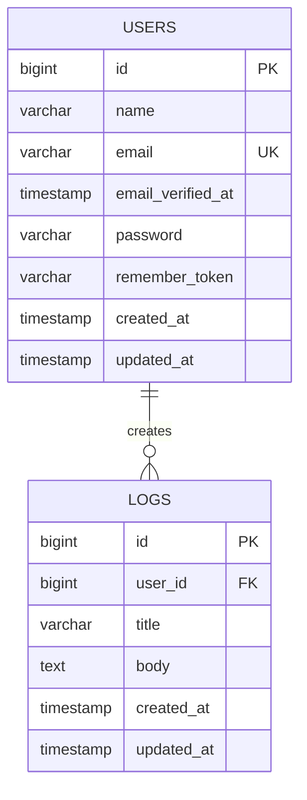

# Loggit v2 データベース設計書

**ドキュメント名**: db-design.md  
**プロジェクト**: Loggit v2  
**バージョン**: 0.1.0

## 1. 概要

本書では、Loggit v2で使用するデータベースの構成を定義する。

MVPでは、以下のデータを管理する。

- ユーザー情報
- ログ情報
- セッション情報
- キャッシュ情報
- ジョブ情報

アプリケーション固有の主要テーブルは、`users`テーブルと`logs`テーブルとする。

## 2. 使用データベース

|項目|内容|
|---|---|
|データベース|MySQL|
|文字コード|utf8mb4|
|照合順序|utf8mb4_unicode_ci|
|タイムゾーン|アプリケーション設定に従う|
|ORM|Laravel Eloquent|

## 3. ER図



### リレーション

- 1人のユーザーは、複数のログを作成できる
- 1件のログは、必ず1人のユーザーに所属する
- ユーザー削除時、そのユーザーが所有するログも削除する

## 4. テーブル一覧

|テーブル名|概要|
|---|---|
|users|ユーザー情報を管理する|
|logs|ユーザーが作成したログを管理する|
|password_reset_tokens|パスワード再設定用トークンを管理する|
|sessions|ログインセッションを管理する|
|cache|キャッシュ情報を管理する|
|cache_locks|キャッシュの排他制御情報を管理する|
|jobs|キューに登録されたジョブを管理する|
|job_batches|バッチジョブを管理する|
|failed_jobs|失敗したジョブを管理する|

## 5. usersテーブル

### 概要

ユーザーの認証情報および基本情報を管理する。

Laravel標準のユーザーテーブルを利用する。

### テーブル定義

|カラム名|データ型|NULL|キー|初期値|説明|
|---|---|:---:|---|---|---|
|id|BIGINT UNSIGNED|不可|PK|-|ユーザーID|
|name|VARCHAR(255)|不可|-|-|ユーザー名|
|email|VARCHAR(255)|不可|UK|-|メールアドレス|
|email_verified_at|TIMESTAMP|可|-|NULL|メール認証日時|
|password|VARCHAR(255)|不可|-|-|ハッシュ化されたパスワード|
|remember_token|VARCHAR(100)|可|-|NULL|ログイン状態保持用トークン|
|created_at|TIMESTAMP|可|-|NULL|作成日時|
|updated_at|TIMESTAMP|可|-|NULL|更新日時|

### 制約

- `email`は一意であること
- `name`は必須であること
- `email`は必須であること
- `password`は必須であること

### インデックス

|インデックス名|対象カラム|種類|
|---|---|---|
|PRIMARY|id|主キー|
|users_email_unique|email|ユニークインデックス|

## 6. logsテーブル

### 概要

ユーザーが作成したログを管理する。

各ログは、1人のユーザーに所属する。

### テーブル定義

|カラム名|データ型|NULL|キー|初期値|説明|
|---|---|:---:|---|---|---|
|id|BIGINT UNSIGNED|不可|PK|-|ログID|
|user_id|BIGINT UNSIGNED|不可|FK|-|ログを作成したユーザーID|
|title|VARCHAR(255)|不可|-|-|ログのタイトル|
|body|TEXT|不可|-|-|ログの本文|
|created_at|TIMESTAMP|可|-|NULL|作成日時|
|updated_at|TIMESTAMP|可|-|NULL|更新日時|

### 制約

- `user_id`は必須であること
- `title`は必須であること
- `title`は255文字以内であること
- `body`は必須であること
- `user_id`は`users.id`に存在すること

### 外部キー

|外部キー名|対象カラム|参照先|削除時|
|---|---|---|---|
|logs_user_id_foreign|user_id|users.id|CASCADE|

ユーザーが削除された場合、そのユーザーが所有するログも削除する。

### インデックス

|インデックス名|対象カラム|種類|目的|
|---|---|---|---|
|PRIMARY|id|主キー|ログを一意に識別する|
|logs_user_id_foreign|user_id|インデックス|ユーザー単位のログ検索|
|logs_user_id_created_at_index|user_id, created_at|複合インデックス|ユーザーごとの新着順表示|

## 7. Laravelモデル設計

### Userモデル

ファイルパス

```text
app/Models/User.php
```

リレーション

```php
public function logs(): HasMany
{
    return $this->hasMany(Log::class);
}
```

### Logモデル

ファイルパス

```text
app/Models/Log.php
```

リレーション

```php
public function user(): BelongsTo
{
    return $this->belongsTo(User::class);
}
```

一括代入を許可する項目

```php
protected $fillable = [
    'title',
    'body',
];
```

`user_id`は、ログイン中のユーザー情報からアプリケーション側で設定する。

## 8. マイグレーション設計

### logsテーブル作成例

```php
Schema::create('logs', function (Blueprint $table) {
    $table->id();
    $table->foreignId('user_id')
        ->constrained()
        ->cascadeOnDelete();
    $table->string('title');
    $table->text('body');
    $table->timestamps();

    $table->index(['user_id', 'created_at']);
});
```

### マイグレーションファイル名

```text
xxxx_xx_xx_xxxxxx_create_logs_table.php
```

Laravelで作成する場合

```bash
sail artisan make:model Log -mf
```

このコマンドで以下を作成する。

- Logモデル
- logsテーブルのマイグレーション
- LogFactory

## 9. データ取得方針

### ログ一覧

ログイン中のユーザーが所有するログのみ取得する。

```php
$request->user()
    ->logs()
    ->latest()
    ->paginate(10);
```

### ログ詳細

対象ログがログイン中のユーザーの所有物であることを確認する。

他人のログにはアクセスできないよう、Policyまたは所有者チェックを使用する。

### ログ作成

`user_id`をリクエストから直接受け取らず、ログインユーザーから設定する。

```php
$request->user()->logs()->create($validated);
```

## 10. 削除方針

MVPでは物理削除を採用する。

ログを削除した場合、データベースから完全に削除する。

将来的に復元機能が必要になった場合は、LaravelのSoft Deletesを導入する。

追加候補カラム

|カラム名|データ型|説明|
|---|---|---|
|deleted_at|TIMESTAMP|論理削除日時|

## 11. 命名規則

### テーブル名

- 複数形
- スネークケース

例

```text
users
logs
password_reset_tokens
```

### カラム名

- スネークケース

例

```text
user_id
created_at
updated_at
```

### 外部キー

参照先テーブルの単数形に`_id`を付ける。

例

```text
user_id
```

### モデル名

- 単数形
- パスカルケース

例

```text
User
Log
```

## 12. セキュリティ要件

- パスワードは平文で保存しない
- Laravelのハッシュ機能を使用する
- 他人のログを取得できないようにする
- `user_id`をフォーム入力値として信用しない
- SQLはEloquentまたはQuery Builderを使用する
- 外部キー制約を設定する
- 更新・削除時は認可処理を行う

## 13. 将来の拡張候補

### tagsテーブル

ログにタグを付与する場合に追加する。

|カラム名|データ型|説明|
|---|---|---|
|id|BIGINT UNSIGNED|タグID|
|user_id|BIGINT UNSIGNED|タグの所有者|
|name|VARCHAR(50)|タグ名|
|created_at|TIMESTAMP|作成日時|
|updated_at|TIMESTAMP|更新日時|

### log_tagテーブル

ログとタグの多対多関係を管理する。

|カラム名|データ型|説明|
|---|---|---|
|log_id|BIGINT UNSIGNED|ログID|
|tag_id|BIGINT UNSIGNED|タグID|

### attachmentsテーブル

画像やファイルを添付する場合に追加する。

|カラム名|データ型|説明|
|---|---|---|
|id|BIGINT UNSIGNED|添付ファイルID|
|log_id|BIGINT UNSIGNED|ログID|
|file_path|VARCHAR(255)|保存先|
|original_name|VARCHAR(255)|元のファイル名|
|mime_type|VARCHAR(100)|MIMEタイプ|
|file_size|BIGINT UNSIGNED|ファイルサイズ|
|created_at|TIMESTAMP|作成日時|
|updated_at|TIMESTAMP|更新日時|

## 14. MVP完成時のデータベース構成

MVPでは、以下の構成を完成形とする。

- `users`と`logs`が1対多で関連している
- ログは必ずユーザーに所属している
- 他人のログは閲覧できない
- ユーザー削除時に所有ログも削除される
- ユーザー単位でログを新しい順に取得できる
- Laravelのマイグレーションで再現可能である